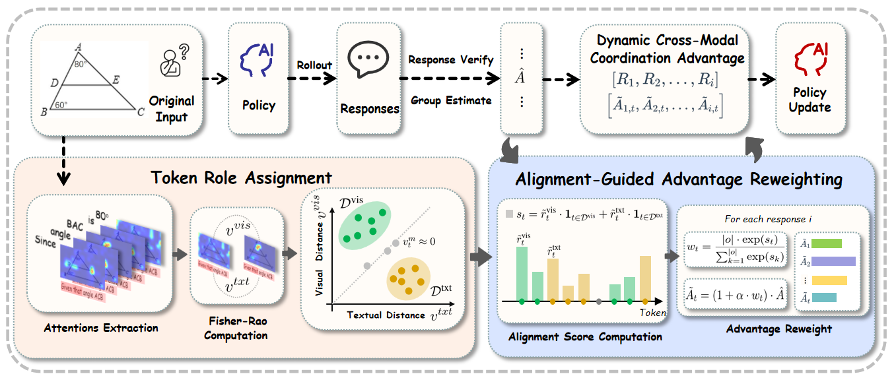
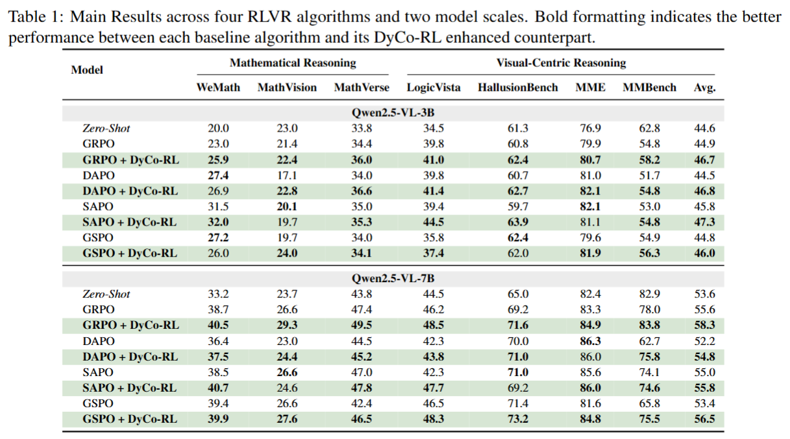

# DyCo-RL: Dynamic Cross-Modal Coordination for Visual Reasoning


<p align="center">
    🌐 <a href="" target="_blank">Blog</a> | 📃 <a href="https://arxiv.org/abs/2606.08035" target="_blank">Paper</a> | 🤗 <a href="" target="_blank">Model</a> |  🤗 <a href="" target="_blank">Training_Data</a> 

</p>


#### [Hangui Lin <sup>2</sup>](https://scholar.google.com/citations?user=ofF4kxIAAAAJ&hl=en), [Yan Shu <sup>1</sup>](https://shuyansy.github.io/), [Zhengyang Liang <sup>3</sup>](https://liang-zhengyang.github.io/), [Chi Liu <sup>4</sup>](https://scholar.google.com/citations?user=abmQYmYAAAAJ&hl=zh-CN), [Xiangrui Liu <sup>2</sup>](https://openreview.net/profile?id=~Minghao_Qin1),  [Minghao Qin <sup>2</sup>](https://lxrrrrrr.github.io/), [Teng Long <sup>1</sup>](https://scholar.google.com/citations?user=5Iv3ul0AAAAJ&hl=en), [Zheng Liu <sup>2</sup>](https://scholar.google.com/citations?user=k2SF4M0AAAAJ&hl=en), [Nicu Sebe <sup>1</sup>](https://scholar.google.com/citations?user=stFCYOAAAAAJ&hl=en)

<sup>1</sup> University of Trento, Italy, <br>
<sup>2</sup> Beijing Academy of Artificial Intelligence (BAAI), <br>
<sup>3</sup> Singapore Management University <br>
<sup>4</sup> IQuest Research <br>

<div align="center">

<div>
  <font size=4>
    <p>🎉  <b>We propose DyCo-RL, a novel approach that embeds dynamic, token-level cross-modal coordination into the RLVR framework.</b></p>
  </font>
</div>
</div>

Reinforcement Learning with Verifiable Rewards (RLVR) has recently become a strong way to improve visual reasoning in Multimodal Large Language Models (MLLMs), but most existing methods still treat all tokens equally during optimization. This ignores an important fact: different tokens actually serve different roles—some need to focus more on images, while others depend more on text context. Through token-level attention analysis, we find that many reasoning errors come from cross-modal misalignment, where visual-related tokens fail to fully attend to images and text-related tokens underuse surrounding context. 

We further verify this through intervention experiments, showing that this mismatch directly leads to performance drops. Based on these insights, we introduce DyCo-RL, a simple and plug-and-play method that dynamically adjusts cross-modal coordination at the token level during RLVR training. Specifically, we estimate each token’s functional role using Fisher–Rao geodesic distance between modality-specific attention patterns, and use a modality attention ratio as a signal to reweight token-level advantages in policy optimization.

DyCo-RL is compatible with multiple RLVR algorithms, including GRPO, GSPO, DAPO, and SAPO, and brings consistent gains when applied to Qwen2.5-VL-3B/7B, improving performance by an average of +1.5% across both visual perception and mathematical reasoning benchmarks.


## 🛠️ Setup

```bash
conda create -n dyco-rl python=3.10
conda activate dyco-rl
bash setup.sh
```

## 💪🏻 Training

### 📚 GRPO/GSPO/SAPO/DAPO

1. Download the [ThinkLite-VL-hard-11k](https://huggingface.co/datasets/russwang/ThinkLite-VL-hard-11k) , and we refer to the image dir as `<your_image_root>`.
2. Change the `data_paths` and `image_folders` wthin the file in `run_scripts/` folder.
3. Run the training code in   `run_scripts/` folder.

### For your own data

<div style="text-align: justify;">

We support data loading the jsonl data  has the format as follows:

```json
{
  "id": 1,
  "image": "Clevr_CoGenT_TrainA_R1/data/images/CLEVR_trainA_000001_16885.png",
  "conversations": [
    {"from": "human", "value": "<image>What number of purple metallic balls are there?"},
    {"from": "gpt", "value": "0"}
  ]
}
```

If you want to use multi-image input, you can use the following format:

```json
{
  "id": 1,
  "image": ["Clevr_CoGenT_TrainA_R1/data/images/CLEVR_trainA_000001_16885.png", "Clevr_CoGenT_TrainA_R1/data/images/CLEVR_trainA_000001_16886.png"],
  "conversations": [
    {"from": "human", "value": "<image><image>What number of purple metallic balls in total within the two images?"},
    {"from": "gpt", "value": "3"}
  ]
}
```


<div style="text-align: justify;">

## 📊 Evaluation



- We  test the model using  [VLMEvalKit](https://github.com/open-compass/VLMEvalKit).You can test our benchmark using following code：
```bash
git clone https://github.com/open-compass/VLMEvalKit.git
conda activate your-env
cd VLMEvalKit
pip install -e .
python run.py  --data  xxxbench  --model Qwen2.5-VL-3B-Instruct  --verbose
```

## Citation
If you find this work useful for your research, please cite our paper :
```
@misc{lin2026dycorldynamiccrossmodalcoordination,
      title={DyCo-RL: Dynamic Cross-Modal Coordination for Visual Reasoning}, 
      author={Hangui Lin and Yan Shu and Zhengyang Liang and Chi Liu and Xiangrui Liu and Minghao Qin and Teng Long and Zheng Liu and Nicu Sebe},
      year={2026},
      eprint={2606.08035},
      archivePrefix={arXiv},
      primaryClass={cs.CV},
      url={https://arxiv.org/abs/2606.08035}, 
}
```
